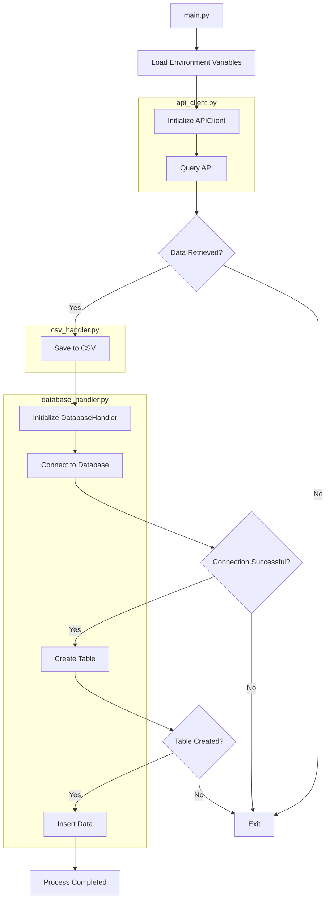

# Cypress Interview Coding Assessment  

## Overview

This project is an Employee Data Management System that interacts with an external API to retrieve employee data, save it to a CSV file, and store it in a MySQL database. It's designed to be efficient and maintainable and follows Python best practices.

## Main Features

1. API Integration: Fetches employee data from a specified API endpoint.
2. CSV Export: Saves retrieved data to a CSV file for easy viewing and sharing.
3. Database Storage: Stores employee data in a MySQL database for persistent storage and easy querying.
4. Error Handling: Implements robust error handling and logging throughout the application.
5. Configurability: Uses environment variables for easy configuration across different environments.

## Project Structure

project_root/  
│ 
├── src/ 
│   ├── init.py 
│   ├── api_client.py 
│   ├── csv_handler.py 
│   └── database_handler.py 
│ 
├── tests/ 
│   ├── init.py 
│   ├── test_api_client.py 
│   ├── test_csv_handler.py 
│   └── test_database_handler.py 
│ 
├── main.py 
├── requirements.txt 
└── README.md 

## Project Flow 

## Setup Instructions

1. Clone the repository:  
`git clone https://github.com/yourusername/employee-data-management.git` 
`cd employee-data-management`

3. Install the required dependencies: 
`pip install -r requirements.txt`

4. Ensure you have MySQL installed and running, and create the database specified in `DB_NAME`.

5. Replace the arbitrary values with real values for the environment variables in the `.env` file.

## Usage

Run the main script: 

`python main.py`

This will:
1. Fetch employee data from the API
2. Save the data to a CSV file
3. Store the data in the MySQL database

## Running Tests

To run the unit tests:
`pytest`

## Code Style

This project uses:
- `flake8` for linting
- `black` for code formatting
- `mypy` for static type checking

To check code style:

`flake8 .` 
`black --check .` 
`mypy .`

## Design Decisions and Rationale
Throughout the development process, I worked closely with Claude AI, using thoughtful prompts and an iterative approach to arrive at the design decisions that shaped this project. Here’s an overview of those decisions and the rationale behind them:

1. **Modular Structure**: I decided to divide the project into separate modules (`api_client.py`, `csv_handler.py`, `database_handler.py`) to promote the separation of concerns. By working with Claude, I was able to refine this structure, making the code more maintainable and testable. This modularity allows each component to function independently, which simplifies both development and testing.

2. **Type Hints**: With Claude's guidance, I incorporated type hints throughout the code. This decision was driven by a desire to improve code readability and catch type-related errors early in the development process. Using type hints also made it easier to understand the expected input and output of functions at a glance.

3. **Environment Variables**: To enhance security and flexibility, I stored sensitive information and configuration details in environment variables. Claude and I discussed best practices for handling sensitive data, which led to this implementation and made the application more secure and easier to configure across different environments.

4. **Logging**: Instead of relying on print statements, I implemented Python’s logging module for output. Claude helped me recognize the importance of logging in production environments, where it’s crucial to have flexibility regarding log levels and output destinations. This decision ensures that debugging and monitoring are both more effective.

5. **Error Handling**: Through back-and-forth discussions with Claude, I implemented comprehensive error handling. This approach makes the application more robust and provides clear feedback when issues occur, which is vital for maintaining a reliable application.

6. **Batch Database Operations**: To improve efficiency when dealing with large datasets, I opted to use `executemany` for database insertions. Claude’s insights into database optimization were invaluable here, helping me implement a method that significantly speeds up database operations.

7. **Context Managers**: I utilized context managers (e.g., `with` statements) for file and database operations to ensure resources are properly closed after use. Claude's advice reinforced the importance of this practice for resource management, preventing potential leaks and errors.

8. **Parameterized Queries**: In response to Claude’s emphasis on security, I used parameterized SQL queries to prevent SQL injection attacks. This was key in ensuring the application's resilience against common vulnerabilities.

9. **Testing**: A comprehensive test suite was developed to ensure the reliability of each component. Claude provided valuable input on testing strategies, which helped me create thorough tests that covered various edge cases and functionality.

10. **Code Quality Tools**: To maintain high code quality and consistency, I integrated tools like `flake8`, `black`, and `mypy` into the development process. Claude suggested these tools and guided me on how to use them effectively, ensuring that the code remains clean, consistent, and error-free.

These design decisions were made from continuous collaboration with Claude AI, where each choice was carefully considered, tested, and refined to create a robust and maintainable application.

## Development Process with AI Assistance

This project was developed using an AI language model, specifically Claude, an AI assistant created by Anthropic. Below, I outline my thought process, the types of queries I made, and why I chose to use AI assistance during the development process.

### Thought Process and Queries

1. **Initial Project Outline**: I started by outlining the project requirements at a high level. I asked the AI to help me brainstorm a basic structure and approach, ensuring that I covered all essential components from the beginning.

2. **Code Generation**: For each specific component, like the API client, CSV handler, and database handler, I requested code generation from the AI. I provided details about the functionality I needed, and the AI-generated the corresponding code, which I then reviewed and refined.

3. **Best Practices and Standards**: To make sure my code adhered to industry standards, I asked the AI about Python best practices, PEP 8 guidelines, and how to maintain a high standard of coding throughout the project. This guidance was crucial in keeping the code clean and maintainable.

4. **Error Handling and Edge Cases**: Recognizing that robust software needs to handle unexpected situations gracefully, I consulted the AI on how to implement comprehensive error handling and how to anticipate and manage edge cases effectively. This step was key to building resilient code.

5. **Testing**: To ensure the reliability of my code, I asked the AI for examples of unit tests and suggestions for testing strategies. This helped me create a solid testing framework that could catch bugs early and ensure that all components worked as expected.

6. **Documentation**: I understood the importance of clear and thorough documentation, so I asked the AI for help in creating detailed docstrings and drafting content for this README. Good documentation was essential for making the codebase understandable and maintainable.

7. **Refining and Improving**: After the initial code generation, I went through several rounds of revisions. I sought the AI's advice on code review, optimization strategies, and areas for improvement. This iterative process helped me polish the code and enhance its performance.

8. **Specific Python Features**: At various points, I needed to leverage specific Python features, such as type hinting and context managers. I turned to the AI for explanations and best practices on how to use these features effectively in my code.

9. **Database Optimization**: Efficient database operations were critical, especially when dealing with large datasets. I queried the AI for guidance on optimizing database interactions, ensuring that the application remained performant even under heavy loads.

10. **Security Considerations**: Security was a top priority, particularly concerning the handling of API tokens and database credentials. I asked the AI for advice on securing these aspects of the application to protect sensitive data.

### Why Use AI Assistance (like Claude) Over Other AI Models (like ChatGPT)

1. **Comprehensive Responses**: I found Claude particularly useful for complex tasks because it provided detailed and nuanced responses, helping me address sophisticated software development challenges.

2. **Code Generation and Explanation**: Claude didn’t just generate code; it also offered detailed explanations, which were invaluable for understanding how the code worked and learning new concepts along the way.

3. **Consistency Across Conversations**: One of the key benefits of using Claude was its ability to maintain context across conversations. This consistency made the development process more coherent and allowed me to build on previous interactions without losing momentum.

4. **Up-to-date Knowledge**: Claude’s regularly updated knowledge base gave me confidence that I was using the latest best practices and libraries, which was crucial for staying current in a fast-evolving field.

5. **Ethical Considerations**: Since I was developing software that might handle personal data, I appreciated Claude’s strong ethical principles, which helped ensure that my approach was responsible and aligned with privacy standards.

6. **Customization**: Claude was flexible enough to be fine-tuned for my specific project needs, understanding the unique requirements and conventions that I wanted to follow.

7. **Handling Complex Queries**: When I encountered particularly challenging problems, Claude’s ability to break them down and provide step-by-step solutions was incredibly valuable. It helped me tackle issues that might have otherwise been overwhelming.

8. **Bias Mitigation**: Claude is designed to minimize biases, which was important to me in ensuring that the code and design suggestions were as objective as possible, leading to more reliable and fair outcomes.

